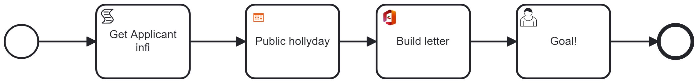

# c8-connector-deployment-challenge

A process `LoanApplication` is provided.



This process contains connectors, accessible on marketplace.
* [Public Holiday Connector](https://marketplace.camunda.com/en-US/apps/419279/public-holiday-connector)

The connector return a list of holidays


* [office to PDF](https://marketplace.camunda.com/en-US/apps/427521/office-to-pdf)

The connector transform a Office document to a PDF, and store it in the Temporary folder of the machine


* [mail Thymeleaf Connector](https://marketplace.camunda.com/en-US/apps/430240/mail-thymeleaf-connector)

The connector create a email from a template, and send it as mail. The Google email SMTP can be used 


On a self-manage cluster, it's necessary to deploy this connector from the marketplace.
Three solutions are expected.

Then, deploy the same process on a Cloud, and use one solution to run the process.

What is expected is to create the process instance, and have the user task "Goal" active.

# Specifications

The process is given ([LoanApplication.bpmn](resources/LoanApplication.bpmn))
The cluster definition is provided ([camunda-cluster.yaml](resources/camunda-cluster.yaml))

You can change the camunda-cluster.yaml, and update your cluster. You must not stop and restart it (helm upgrade is your friends) 

You must provide three different solutions:
* Solution 1 is based on the connector-runtime 
* Solution 2 is based on a different connector runtime, like [Cherry runtime](https://github.com/camunda-community-hub/zeebe-cherry-runtime) or [Friendly connector runtim](https://github.com/camunda-community-hub/camunda-8-friendly-connector-runtime)
* Solution 3 is based on a development solution: take the source and build a new docker image from the source code

# Preparation

Create a cluster from the value.yaml file

```cmd
helm install --namespace camunda camunda camunda/camunda-platform -f camunda-values-google.yaml --skip-crds
```
Upload the process from a modeler.


Start a process instance in the `LoanApplication`. This process instance is pause at the first service task.

> **⚠ Warning**
> You can upgrade the cluster, change parameters, but you are not able to stop Zeebe or/and clean the cluster at any time: this is a running cluster in production


# Solution

A solution path is given under the folder "solution".


