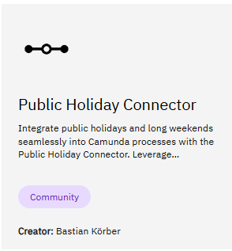
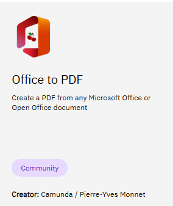

# Using the Connector Runtime

## Introduction
The connector runtime is provided with the Helm Chart, and there is no configuration to specify.

How to connect the three connectors inside?

## Public Holiday
This connector is a template to the REST connector, which is included in the connector runtime. There is no deployment to do.

[Public Holiday Connector](https://marketplace.camunda.com/en-US/apps/419279/public-holiday-connector)
  

## Office to PDF

* [office to PDF](https://marketplace.camunda.com/en-US/apps/427521/office-to-pdf)
  

## Email Thym

* [mail Thymeleaf Connector](https://marketplace.camunda.com/en-US/apps/430240/mail-thymeleaf-connector)
  

